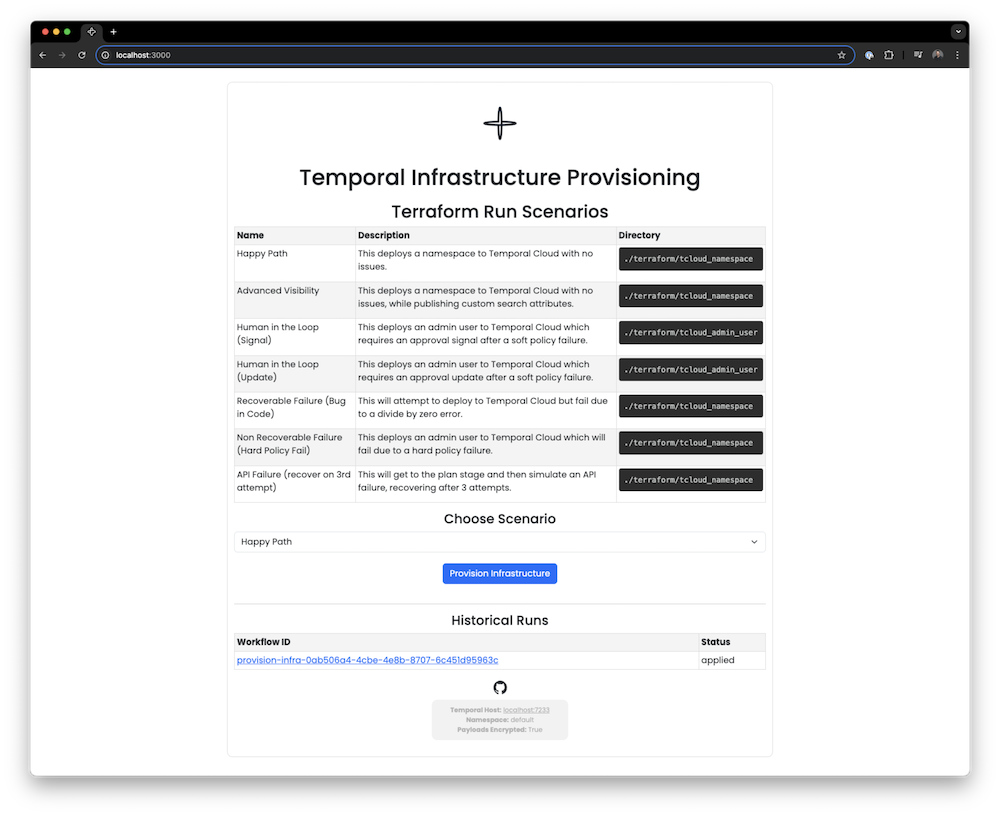

# Temporal Infrastructure Provisioning

| Prerequisites      |    | Features       |    | Patterns            |    |
|:-------------------|----|----------------|----|---------------------|----|
| Network Connection | ✅ | Schedule       |    | Entity              |    |
| Python 3.12        | ✅ | Timer          | ✅ | Fanout              |    |
| Poetry 1.8.3       | ✅ | Local Activity |    | Long-Running        | ✅ |
| Terraform 1.9.0    | ✅ | Signal         | ✅ | Continue As New     |    |
| Open Policy Agent  |    | Query          | ✅ | Manual Intervention | ✅ |
| GitHub Actions     |    | Heartbeat      | ✅ | Long-polling        |    |
|                    |    | Update         | ✅ | Polyglot            |    |
|                    |    | Retry          | ✅ |                     |    |
|                    |    | Data Converter | ✅ |                     |    |
|                    |    | Codec Server   | ✅ |                     |    |
|                    |    | Custom Attrs   | ✅ |                     |    |
|                    |    | SDK Metrics    | ✅ |                     |    |




This demo has the building blocks for you to execute any terraform code to completion, but is
focused on provisioning namespaces and users in Temporal Cloud. Because of that, you will need to
generate a Temporal Cloud API key for usage with the Terraform plan. This is also a sensitive value
and will be published to whatever Temporal server you connect to, so it is recommended to leverage
the `ENCRYPT_PAYLOADS` variable, or that you retire the credential you use in the demo immediately.

Note that this repo will create a namespace in the target Temporal Cloud account, so you should
always be sure to clean up the infrastructure you provision, by `cd`ing in to the Terraform
directory that you applied in the demo and running `terraform destroy`.

## Provision Workflow

### Provision Activities

Each of these activities has a short sleep period associated with them, to simulate a longer running
`terraform plan` and `terraform apply`, as well as longer policy evaluation.

- Terraform Init
- Terraform Plan
- Evaluate Policy
- Terraform Apply (leverages Heartbeats)
- Terraform Destroy (leverages Heartbeats)
- Terraform Output

### Provision Signals

- Human Approval of Policy Failure
- Human Denial of Policy Failure

### Provision Updates

- Human Approval of Policy Failure
- Human Denial of Policy Failure

### Provision Queries

- Get Status
- Get Reason
- Get Plan
- Get Progress

## Scenarios

### Happy Path

This deploys a namespace to Temporal Cloud with no issues.

### Advanced Visibility

This deploys a namespace to Temporal Cloud with no issues, while publishing custom search
attributes.

### Human in the Loop (Signal)

This deploys an admin user to Temporal Cloud which requires an approval signal after a soft policy
failure.

### Human in the Loop (Update w/ Validation)

This deploys an admin user to Temporal Cloud which requires an approval update after a soft policy
failure. This is the same as the signal path, but the update will fail if the reason is empty.

### Recoverable Failure (Bug in Code)

This deploys an admin user to Temporal Cloud which will fail due to uncommenting an exception in
the terraform_plan activity and restarting the worker, then recommenting and restarting the worker.

### Non-Recoverable Failure (Hard Policy Failure)

This can deploy an admin user to Temporal Cloud which will fail due to a hard policy failure, or
can delete the environment variables and fail out w/ a `non_retryable_error`.

### API Failure (Recover on 5th Attempt)

This will get to the plan stage and then simulate an API failure, recovering after 5 attempts.

## Running the Demo

### Installing Dependencies

Make sure you have [Terraform](https://www.terraform.io/) installed, as the runner shells out
from Python to execute the locally installed `terraform` binary.

```bash
brew tap hashicorp/tap
brew install hashicorp/tap/terraform
```

Install poetry (if you haven't already), then install the Python dependencies for this project.

```bash
pipx install poetry
poetry install
```

### Configuring the Environment

To generate an API key, use `tcld`, you'll need to `tcld login` first to do this.

```bash
tcld apikey create -n "terraform-test" --desc "Testing the API Key for the TF Provider" -d 90d
```


Be sure to then set your Temporal Cloud API key environment variable.

```bash
export TEMPORAL_CLOUD_API_KEY="<secretKey>"
```

By default, this demo will run against `localhost:7233` in the `default` namespace, on the
`provision-infra` task queue, with no TLS configured. All of this can be overriden with the below
environment variables. Be sure these environment variables are present in each environment you are executing
workers, starters, or the UI in.

```bash
export TEMPORAL_HOST_URL="<namespace>.<accountId>.tmprl.cloud:7233"
export TEMPORAL_MTLS_TLS_CERT="/path/to/ca.pem"
export TEMPORAL_MTLS_TLS_KEY="/path/to/ca.key"
export TEMPORAL_NAMESPACE="default"
export TEMPORAL_INFRA_PROVISION_TASK_QUEUE="infra-provisioning"
```

If you plan to use Data Converters and a Codec server, you'll need to update the `ENCRYPT_PAYLOADS`
env var as well.

```bash
export ENCRYPT_PAYLOADS="true"
```

Lastly, to make sure that the namespaces and users that are generated from this demo can be
attributed to a specific individual, please use the following environment variable to denote your
name. _The Terraform configuration will not execute without this value._

```bash
export TF_VAR_prefix="neil"
```

### Running and Configuring the Temporal Dev Server (Option #1)

If you are using the Temporal Dev Server, start the server with the `frontend.enableUpdateWorkflowExecution` config
option set to `true`, which will allow us to perform updates to our workflows.

```bash
temporal server start-dev --db-filename temporal.sqlite --dynamic-config-value frontend.enableUpdateWorkflowExecution=true
```

Before kicking off the starter or using the UI, make sure the custom search attributes have been
created. If you are using the Temporal dev server, use the `operator search-attribute create`
command.

```bash
temporal operator search-attribute create --namespace $TEMPORAL_NAMESPACE --name provisionStatus --type text
temporal operator search-attribute create --namespace $TEMPORAL_NAMESPACE --name tfDirectory --type text
temporal operator search-attribute create --namespace $TEMPORAL_NAMESPACE --name scenario --type text
```

### Configuring Temporal Cloud (Option #2)

If you are using Temporal Cloud, the command will look a bit different, using `tcld namespace search-attributes-add`.
If you are not already logged into Temporal Cloud with `tcld` run `tcld login`.

```bash
tcld namespace search-attributes add -n $TEMPORAL_NAMESPACE --sa "provisionStatus=Text" --sa "tfDirectory=Text" --sa "scenario=Text"
```

### Running the Workflow

Then run the worker (be sure you have the environment variables set).

```bash
poetry run python worker.py
```

Once you start the worker, submit a workflow using the starter (this also needs the environment
variables set).

```bash
poetry run python starter.py
```

### Starting the UI

Once you have run your first starter and confirmed that you have wired up the server, worker, and
starter, it's time to to start up the UI. This is where the most time will be spent with the demo.

```bash
poetry run python web_server.py
```

### Running and Using the Local Codec Server

If you are running your workflows with `ENCRYPT_PAYLOADS=true`, you'll likely want to use the
provided codec server. To start the Codec server locally, use the below command. Note the `--web`
is the URL from which the codec server will allow incoming CORS requests.

```bash
poetry run python codec_server.py --web http://localhost:8233
```

In the Temporal UI, configure your Codec server to use `http://localhost:8081/encryption_codec` and
do not check any other boxes. If you intend to use the compression codec that is available in the
data converter, you can use `http://localhost:8081/compression_codec`.

### Using the SA Shared Codec Server

In the Temporal UI, configure your Codec server to use `https://codec.tmprl-demo.cloud` and check
the "pass the user access token" box.

### Interacting with the Workflows

If you introduce a Terraform stanza that provisions a user with admin permissions, this workflow
will pause and wait for a signal or update to approve or deny the execution of the plan. If going
down the signal path, you don't need to provide a reason, but if you go down the update path, you
need to provide a reason for approval.


#### Signaling a Workflow

Signals are asynchronous, and do not require a message with the decision.

```bash
temporal workflow signal \
    --workflow-id="<workflow-id>" \
    --name update_apply_decision \
    --decision '{"is_approved": false"}'
```

#### Updating a Workflow

Updates are synchronous, and require a message with the decision to be accepted.

```bash
temporal workflow update \
    --workflow-id="<workflow-id>" \
    --name update_apply_decision \
    --decision '{"is_approved": true, "reason": "Approved after review"}'
```

#### Querying a Workflow

To query a workflow for it's current status, the plan, the signal reason or the progress, you can
use the below commands with the relevant in place of the current workflow ID.

```bash
temporal workflow query \
    --workflow-id="<workflow-id>" \
    --type="get_current_status"

temporal workflow query \
    --workflow-id="<workflow-id>" \
    --type="get_progress"

temporal workflow query \
    --workflow-id="<workflow-id>" \
    --type="get_plan"

temporal workflow query \
    --workflow-id="<workflow-id>" \
    --type="get_reason"
```

If you want to inspect the workflow more closely from the CLI, and you have `ENCRYPT_PAYLOADS=true`,
you can decrypt the payload with a command like the following.

```bash
temporal workflow show \
   --workflow-id <workflow-id> \
   --codec-endpoint 'http://localhost:8081/default'
```

#### Resetting a Workflow

There may be a scenario in which an approval takes so long to come in, that the state of the
infrastructure may have drifted, meaning Terraform's plan is no longer valid. In that case, you
can reset the workflow execution to the plan stage, and get a new plan and policy check.

```bash
temporal workflow reset \
    --workflow-id="<workflow-id>" \
    --event-id="<event-id>"
```

### Using SDK Metrics

The worker will have SDK metrics for Prometheus enabled by default. To start up Prometheus and
Grafana quickly for a demo, follow the below.

```bash
cd metrics/
docker-compose up
```

When you connect to your Prometheus from Grafana, use the URL `http://prometheus:9090`. There is
an example dashboard to leverage in `metrics/dashboards/sdk-general.json`.

### Cleaning Up

This demo provisions real namespaces and real admin users inside of Temporal Cloud, and we do not
want those to linger around. Although they have a naming convention that makes it very clear that
they are spawned from this demo, be a good citizen and clean up after yourself. To do so, make
sure that you have your `TEMPORAL_CLOUD_API_KEY` env var set, then run the following. You will
have to move around the directories depending on what you need to `destroy`.

*DO NOT DELETE THEM IN THE UI - THIS WILL CAUSE YOUR TERRAFORM STATE TO DRIFT!*

```bash
cd terraform/tcloud_namespace/
terraform destroy -auto-approve
```

```bash
cd terraform/tcloud_admin_user/
terraform destroy -auto-approve
```